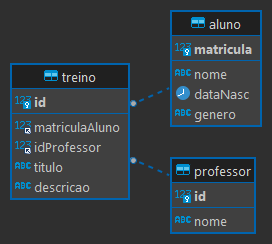
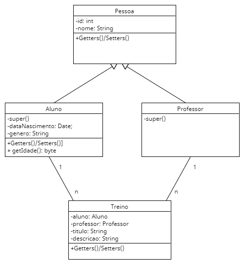
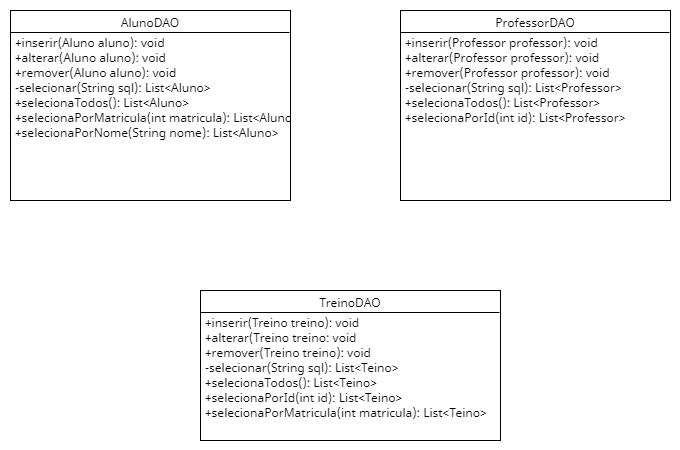
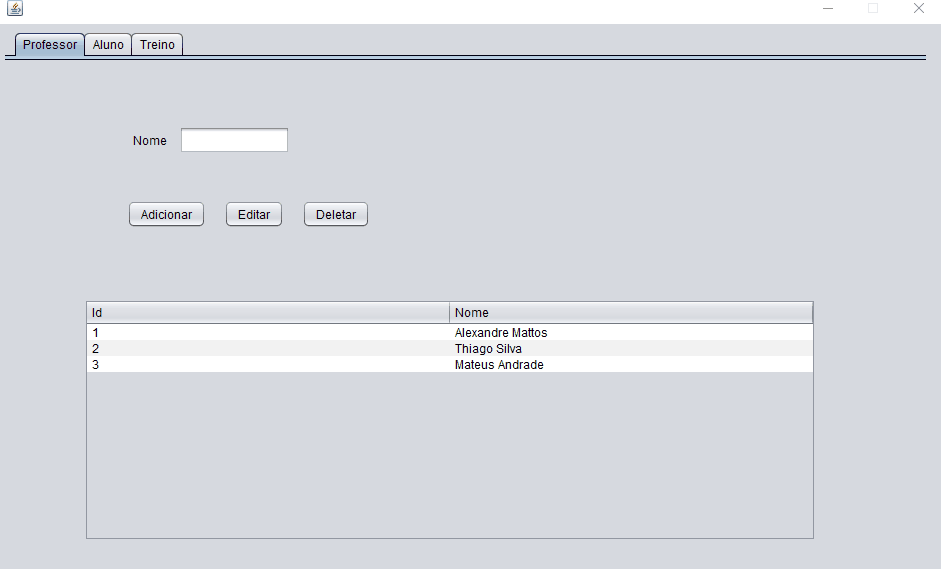
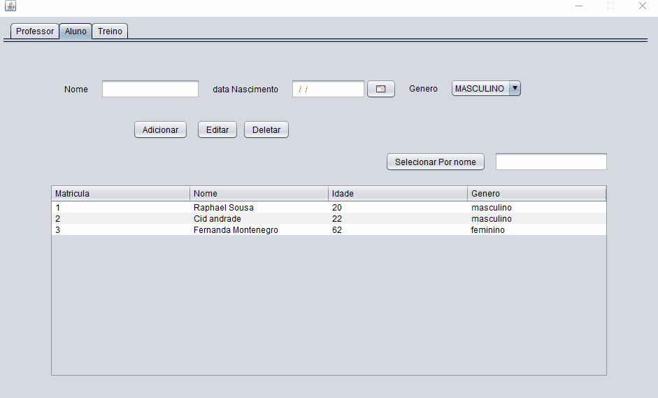
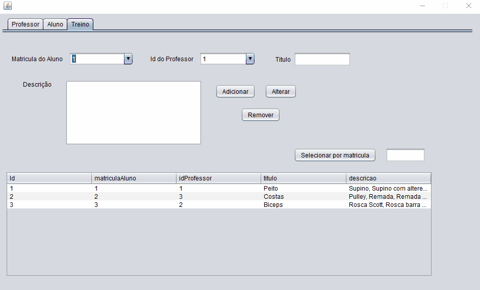
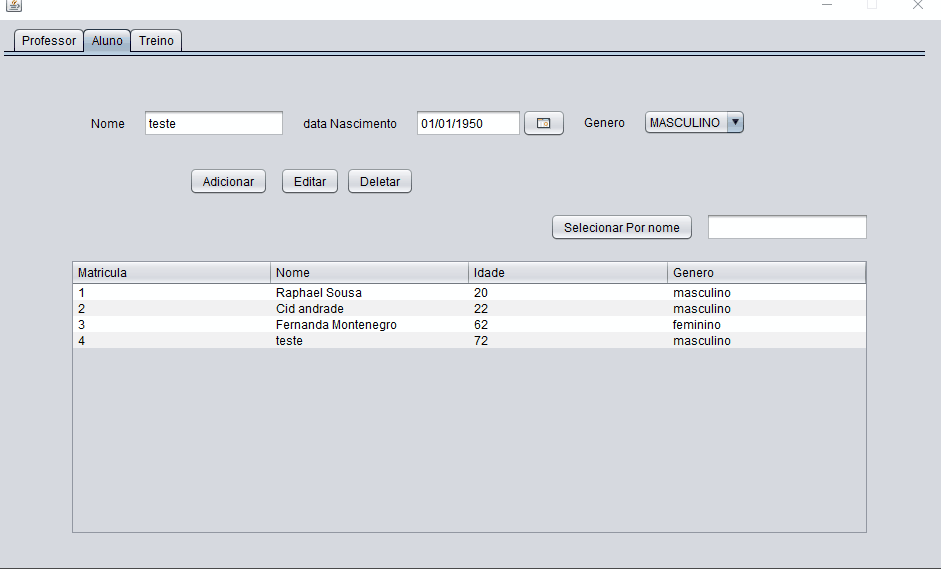
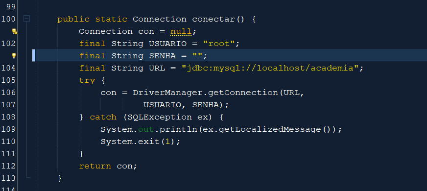

## Exercício final do curso entrypoint JAVA da Brq, professor Cid Andrade.
Enunciado: Crie um projeto com interface gráfica que contenha ao menos duas tabelas relacionadas entre si com ligação ao banco de dados.


### Simulei alguns passos de criação de um programa para aplicar conceitos vistos em aulas:
1. Levantamento de requisitos
2. Modelagem/criação do banco de dados
3. UML
4. Interface gráfica
5. Classes de conexão de Banco de dados
6. Classes de entidades de BD
7. Classes DAO
8. Conexão interface gráfica e DAO
9. Testes finais
10. Otimização de código
11. Documentação
12. As-built, APU
13. Registro de aprendizado
<br><br>

# Sumário
1. [Aprendizados e Conceitos utilizados](#aprendizados-e-conceitos-utilizados)
2. [Descrição do Sistema](#descrição-do-Sistema)
    - [Requisitos Funcionais do Sistema](#requisitos-funcionais-do-sistema)
    - [Descrição do Banco de dados](#descrição-do-banco-de-dados)
    - [Uml das entidades](#uml-das-entidades)
    - [Uml classes DAO](#uml-das-classes-dao)
3. [Demonstração do Programa](#demonstração-do-programa)
    - [Tabela Professores - Crud Completo](#tabela-professores---crud-completo)
    - [Tabela Alunos - Crud Completo](#tabela-alunos---crud-completo)
    - [Tabela Treinos - Crud Completo](#tabela-treinos---crud-completo)
    - [Apagando alunos com treinos registrados](#apagando-alunos-com-treinos-registrados)
4. [Configuração](#configuração)
<br><br>

# Aprendizados e Conceitos utilizados

- Facade pattern ([Link da aula (A partir de 2:39:00)](https://drive.google.com/file/d/1IJ41peZxeZjh6FILkBide3aBz8K3-8kZ/view))
    - [Código facade](./src/br/com/raphsousa/academia/controller/AcademiaFacade.java)
    Na outra branch é possivel visualizar como ficaria o código sem facade (vá até o arquivo academiGUI)
- DAO pattern
- Hereditariedade
- JDBC
- Formatação e inserção de datas no BD (SimpleDateFormat) - [Código](./src/br/com/raphsousa/academia/modelo/entidades/Aluno.java)
- Interface gráfica do Java
- JDateChooser (calendario para escolher datas na interface gráfica)
- Autocomplete de comboboxes
<br><br>

# Descrição do Sistema
Programa que é capaz de adicionar um treino para um aluno de academia, referenciando o professor que o deu. 
<br>

## Requisitos Funcionais do Sistema
1. O sistema deve permitir o CRUD de alunos, professores e treinos.
2. O sistema deve ter uma aba para cada tabela.
3. O sistema deve calcular automaticamente a idade do aluno ao demonstrar na interface gráfica.2. O sistema deve ter um selecionador de data (ao invés de um campo text) para o aluno.
4. O sistema deve demonstrar os dados do banco de dados em forma de tabela na interface gráfica.
5. O sistema deve ter um campo para selecionar treinos por ID.
6. O sistema deve ter um campo para selecionar alunos por Nome.
<br>

## Descrição do Banco de dados
Tabela Aluno deve conter Matricula (Id), Nome, Data de Nascimento e Gênero, pois alguns treinos são somente aplicados a determinadas idades e gênero.

Tabela Professor deve conter apenas seu Id e Nome.

Tabela Treino recebe os id/matricula de professor e aluno, o Nome do treino e uma descrição, além de possuir um id próprio

### Diagrama do Banco de dados


<br><br>

## UML das Entidades

<br><br>

## UML das Classes DAO

<br><br>

# Demonstração do Programa
A seguir alguns gifs com a demonstração do funcionamento pleno do programa para referência.

## Tabela Professores - Crud Completo

<!--  -->
<br><br>

## Tabela Alunos - Crud Completo

<!--  -->

## Tabela Treinos - Crud Completo

<!--  -->
<br><br>

## Apagando alunos com treinos registrados

<!--  -->

## Configuração
### Conexão Banco de Dados
Antes de iniciar o projeto deve-se alterar no código [academiaBD - linha 100](./src/br/com/raphsousa/academia/modelo/bd/AcademiaBD.java) para o usuário e senha do seu mysql e criar o banco de dados utilizado no mysql, no caso "academia" (comando "Create database academia"). Após isso estará pronto para ser iniciado
<br>

```java
    public static Connection conectar() {
        Connection con = null;
        final String USUARIO = "root";
        final String SENHA = "";
        final String URL = "jdbc:mysql://localhost/academia";
        try {
            con = DriverManager.getConnection(URL,
                    USUARIO, SENHA);
        } catch (SQLException ex) {
            System.out.println(ex.getLocalizedMessage());
            System.exit(1);
        }
        return con;
    }
```

<!--  -->